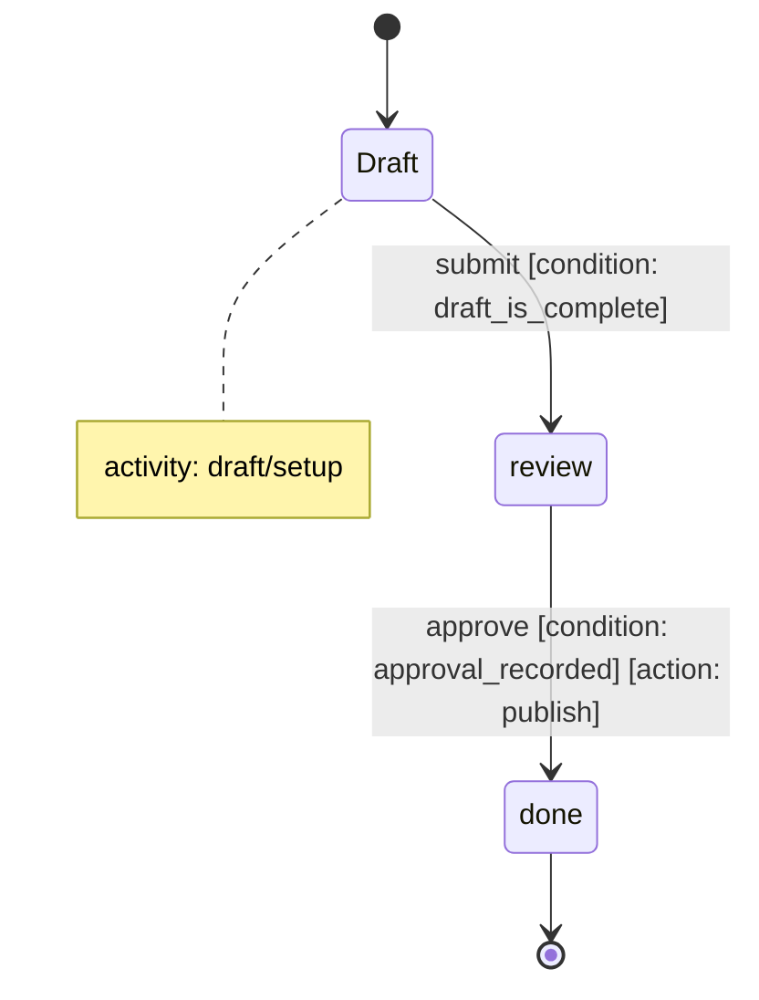

# Workflow Design Guide

Use this guide to design a new workflow from scratch.

## Design Steps

1. List the user-visible states first.
2. Mark the single entry point with `[*] --> state_id`.
3. Draw the happy-path transitions in the order the engine should evaluate them.
4. Add `note ... of <state>` blocks for state-entry activities.
5. Add transition annotations for executable conditions and actions.
6. Validate the graph for:
   - unreachable states,
   - deadlocks,
   - missing conditions on decision transitions.

## Mermaid Conventions

## Review Checklist

- Each non-terminal state has at least one outgoing transition.
- Each branching transition has a named condition.
- Activities and actions point to stable external handlers.
- The rendered Mermaid diagram is readable enough to serve as documentation.
